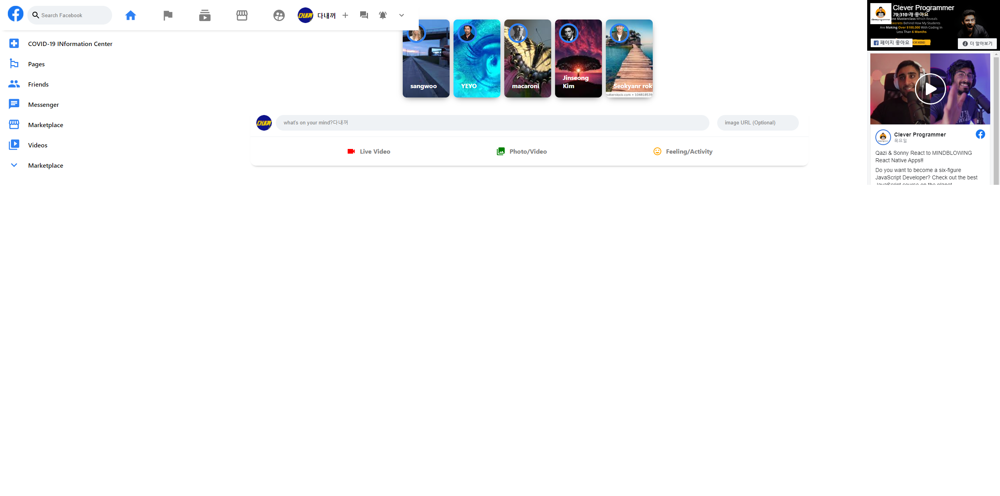

# FaceBook clone

> React + React Hooks 사용법 학습 
> React context API -> REDUX pattern 학습 
> css 프레임워크 MATERIAL UI 학습 
> FLEXBOX 학습 
> Firebase's Firestore realtime DB 연동방법 학습 
> Firebase hosting방법 학습 (다만 여기선 netlify로 배포) 
> Firbase Google Authentication (FULL LOGIN) 방법 학습 
> React flip move 

### 구현 동작

